# DevOps Agent Orchestra

[](https://github.com/ddevalco/devops-agent-orchestra)
[](https://github.com/ddevalco/devops-agent-orchestra/commits/main)
[](https://github.com/ddevalco/devops-agent-orchestra/issues)
[](https://github.com/ddevalco/devops-agent-orchestra/stargazers)


Multi-agent development system for VS Code with a global-first setup, orchestration flows, and one-command bootstrap scripts.

This project is inspired by [simkeyur/vscode-agents](https://github.com/simkeyur/vscode-agents), and extends it with:

- workspace/global install helpers
- easier VS Code custom-agent setup
- expanded local docs/templates for repeatable runs
- practical orchestration runbooks for real multi-repo workspaces

## What You Get

- **18 specialist agents** including: Clarifier, Orchestrator, Planner, Junior/Mobile/Frontend/Backend/Fullstack, Senior Frontend/Backend/Fullstack, Data Engineer, Designer, Documentation Agent, Prompt Writer, DevOps, Reviewer, plus fallback Executor. New Mobile Developer handles Swift/SwiftUI/iOS.
- Orchestrator-first workflow: you mostly select `Orchestrator`, provide objective + constraints, and let delegation happen.
- File-overlap aware parallelization and reviewer gate before final reporting.
- **Validation runbook** with standard test commands for Node.js, Python, Go, Swift/iOS.
- **Recovery runbook** with error procedures and escalation criteria.
- **Memory tool fallback** ensures graceful degradation without experimental tools.
- **E2E validated** with 100% pass rate and zero boundary violations.
- Ready-to-install prompt files in `prompts/`.

## Agent Architecture

```mermaid
graph TB
        User[👤 User Request] --> Clarifier
        Clarifier --> Orchestrator
        Orchestrator --> Planner

        Orchestrator --> DevTeam
        Orchestrator --> Designer
        Orchestrator --> DataEng
        Orchestrator --> PromptWriter
        Orchestrator --> DevOps
        Orchestrator --> Reviewer

        subgraph "Development Team"
            DevTeam --> Junior
            DevTeam --> Mobile
            DevTeam --> Frontend
            DevTeam --> Backend
            DevTeam --> Fullstack
            Frontend -.escalate.-> SrFrontend
            Backend -.escalate.-> SrBackend
            Fullstack -.escalate.-> SrFullstack
            Mobile -.escalate.-> SrFullstack
        end
```



## Workflow (Orchestrator-led)


## Key Features

**v0.4.0 - Production Ready**

- ✅ **Autonomous Orchestration** - Clarifier → Planner → Parallel Execution → Reviewer workflow
- ✅ **18 Specialist Agents** - Including new iOS Mobile Developer for Swift/SwiftUI
- ✅ **Operational Hygiene** - Auto-updates CHANGELOG/BACKLOG without prompting
- ✅ **Validation Runbook** - Standard commands for Node.js, Python, Go, Swift/iOS
- ✅ **Recovery Runbook** - Error procedures and escalation criteria
- ✅ **Memory Fallback** - Works without experimental tools
- ✅ **E2E Validated** - 100% test pass rate, zero boundary violations
- ✅ **Tool Boundaries** - Orchestrator coordinates, never implements
- ✅ **Parallel Execution** - File-overlap detection with smart scheduling

See [CHANGELOG.md](CHANGELOG.md) for complete release notes.

## Install Options

### Option A: Workspace-wide auto-discovery (fastest)

Use workspace `.github/agents` so agents appear in picker for this workspace.

```bash
bash scripts/install-workspace-agents.sh /Users/danedevalcourt/iPhoneApp
```

Then run `Developer: Reload Window`.

### Option B: Profile-global install (all projects in this VS Code profile)

```bash
bash scripts/install-global-agents.sh
```

If your shell cannot write to VS Code User Data directly, use **Configure Custom Agent** → **User Data** and paste from `prompts/*.md`.

## Quick Start

1. Open your target workspace in VS Code.
2. Ensure prompts are installed (workspace/global).
3. Select `Orchestrator` in the agent picker.
4. Provide objective + constraints + repo(s) in scope.

## Project Layout

- `prompts/` install-ready agent definitions
- `docs/` setup, availability, workflow, policy, runbook
- `templates/` clarified requirements, execution plan/packet, review/final report templates
- `scripts/` scaffolding and bulk install helpers
- `runs/` local orchestration artifacts (gitignored)

## Added Improvements Over Upstream

- Bulk local installer scripts for workspace/global setup
- Improved docs for VS Code `User Data` vs `.github/agents` behavior
- Practical troubleshooting for invalid-name/install issues
- Expanded orchestration prompt with specialist routing strategy

## Validation

- ✅ E2E Test Passed - 100% pass rate with zero boundary violations
- ✅ Installation Validated - See [docs/INSTALLATION_VALIDATION.md](docs/INSTALLATION_VALIDATION.md)

**For Development:**

- Validation: [docs/VALIDATION_RUNBOOK.md](docs/VALIDATION_RUNBOOK.md)
- Error Recovery: [docs/RECOVERY_RUNBOOK.md](docs/RECOVERY_RUNBOOK.md)
- Architecture: [docs/ARCHITECTURE.md](docs/ARCHITECTURE.md)

## Credits

- Original architecture and multi-agent concept inspiration: [simkeyur/vscode-agents](https://github.com/simkeyur/vscode-agents)
- For the original roster tables, install badges, and full upstream narrative/examples, see upstream README directly.
