# Danes Agent Orchestra

[](https://github.com/ddevalco/danes-agent-orchestra)
[](https://github.com/ddevalco/danes-agent-orchestra/commits/main)
[](https://github.com/ddevalco/danes-agent-orchestra/issues)
[](https://github.com/ddevalco/danes-agent-orchestra/stargazers)

Multi-agent development system for VS Code with a global-first setup, orchestration flows, and one-command bootstrap scripts.

This project is inspired by [simkeyur/vscode-agents](https://github.com/simkeyur/vscode-agents), and extends it with:

- workspace/global install helpers
- easier VS Code custom-agent setup
- expanded local docs/templates for repeatable runs
- practical orchestration runbooks for real multi-repo workspaces

## What You Get

- Full roster: Clarifier, Orchestrator, Planner, Junior/Frontend/Backend/Fullstack, Senior Frontend/Backend/Fullstack, Data Engineer, Designer, Prompt Writer, DevOps, Reviewer, plus fallback Executor.
- Orchestrator-first workflow: you mostly select `Orchestrator`, provide objective + constraints, and let delegation happen.
- File-overlap aware parallelization and reviewer gate before final reporting.
- Ready-to-install prompt files in `prompts/`.

## Agent Architecture

```mermaid
graph TB
        User[👤 User Request] --> Clarifier
        Clarifier --> Orchestrator
        Orchestrator --> Planner

        Orchestrator --> DevTeam
        Orchestrator --> Designer
        Orchestrator --> DataEng
        Orchestrator --> PromptWriter
        Orchestrator --> DevOps
        Orchestrator --> Reviewer

        subgraph "Development Team"
            DevTeam --> Junior
            DevTeam --> Frontend
            DevTeam --> Backend
            DevTeam --> Fullstack
            Frontend -.escalate.-> SrFrontend
            Backend -.escalate.-> SrBackend
            Fullstack -.escalate.-> SrFullstack
        end
```



## Workflow (Orchestrator-led)


## Install Options

### Option A: Workspace-wide auto-discovery (fastest)

Use workspace `.github/agents` so agents appear in picker for this workspace.

```bash
bash scripts/install-workspace-agents.sh /Users/danedevalcourt/iPhoneApp
```

Then run `Developer: Reload Window`.

### Option B: Profile-global install (all projects in this VS Code profile)

```bash
bash scripts/install-global-agents.sh
```

If your shell cannot write to VS Code User Data directly, use **Configure Custom Agent** → **User Data** and paste from `prompts/*.md`.

## Quick Start

1. Open your target workspace in VS Code.
2. Ensure prompts are installed (workspace/global).
3. Select `Orchestrator` in the agent picker.
4. Optionally paste `prompts/native-orchestrator-kickoff.md`.
5. Provide objective + constraints + repo(s) in scope.

## Project Layout

- `prompts/` install-ready agent definitions
- `docs/` setup, availability, workflow, policy, runbook
- `templates/` clarified requirements, execution plan/packet, review/final report templates
- `scripts/` scaffolding and bulk install helpers
- `runs/` local orchestration artifacts (gitignored)

## Added Improvements Over Upstream

- Bulk local installer scripts for workspace/global setup
- Improved docs for VS Code `User Data` vs `.github/agents` behavior
- Practical troubleshooting for invalid-name/install issues
- Expanded orchestration prompt with specialist routing strategy

## Release Checklist

- [ ] Confirm all agent prompts load and appear in VS Code agent picker
- [ ] Validate workspace install via `scripts/install-workspace-agents.sh`
- [ ] Validate global install via `scripts/install-global-agents.sh`
- [ ] Run one full orchestrated cycle (`Clarifier` → `Planner` → specialists → `Reviewer`)
- [ ] Verify docs/screenshots are current and match the shipped flow
- [ ] Tag release (`v0.x.y`) and publish release notes

## Credits

- Original architecture and multi-agent concept inspiration: [simkeyur/vscode-agents](https://github.com/simkeyur/vscode-agents)
- For the original roster tables, install badges, and full upstream narrative/examples, see upstream README directly.
