# Architecture

This document provides a comprehensive overview of the danes-agent-orchestra system architecture, components, and operational patterns.

**Last Updated:** 2026-02-17  
**Version:** 0.4.0

---

## Table of Contents

- [System Overview](#system-overview)
- [Component Architecture](#component-architecture)
- [Agent Roster](#agent-roster)
- [Communication Patterns](#communication-patterns)
- [Concurrency Model](#concurrency-model)
- [Tool Capability Matrix](#tool-capability-matrix)
- [Data Flow](#data-flow)
- [Installation & Deployment](#installation--deployment)
- [Design Decisions](#design-decisions)

---

## System Overview

danes-agent-orchestra is a multi-agent orchestration system built on VS Code's native chat agent capabilities. It enables complex software development tasks through coordinated delegation among specialized AI agents.

### Core Principles

1. **Native-first:** Built on VS Code Chat Agent API, not external scripts
2. **Orchestrator-led:** Central coordinator delegates to specialists
3. **Tool-bounded:** Each agent has explicitly defined capabilities
4. **Concurrent-aware:** File overlap detection prevents race conditions
5. **Gated review:** All work passes through validation before delivery

### High-Level Architecture

```mermaid
graph TB
    User[👤 User] --> VSCode[VS Code Chat Interface]
    VSCode --> Orchestrator[🎭 Orchestrator]
    
    Orchestrator --> Clarifier[🔍 Clarifier]
    Orchestrator --> Planner[📋 Planner]
    Orchestrator --> Specialists[👥 Specialist Agents]
    Orchestrator --> Reviewer[✅ Reviewer]
    
    Clarifier -.feedback.-> Orchestrator
    Planner -.execution plan.-> Orchestrator
    Specialists -.results.-> Orchestrator
    Reviewer -.approve/reject.-> Orchestrator
    Orchestrator --> User
    
    subgraph "Agent Registry"
        Orchestrator
        Clarifier
        Planner
        Specialists
        Reviewer
    end
    
    subgraph ToolLayer["Tool Layer"]
        ReadFile[read_file]
        RunSubagent[runSubagent]
        Memory[memory]
        Search[search]
        Edit[edit]
        CLI[run_in_terminal]
    end
    
    Specialists -.uses.-> ToolLayer
```



---

## Component Architecture

### Core Components

#### Orchestrator (Control Plane)

- **Role:** Central coordinator and decision-maker
- **Tools:** `read_file`, `runSubagent`, `memory` only
- **Responsibilities:**
  - Intake user objectives and constraints
  - Decide when to invoke Clarifier
  - Always invoke Planner for non-trivial work
  - Parse execution plan into phases
  - Detect file overlap and enforce sequential execution
  - Delegate packets to specialists
  - Route completed work through Reviewer
  - Generate final report to user
- **Key Constraint:** Never writes implementation code directly

#### Clarifier (Requirements Refinement)

- **Role:** Resolve ambiguity in user requests
- **Output States:** `clear`, `clarified`, `assumptions`
- **Invocation:** Only when ambiguity blocks implementation
- **Decision Criteria:**
  - Missing critical context
  - Multiple valid interpretations
  - High-risk assumptions needed

#### Planner (Execution Strategy)

- **Role:** Decompose objectives into phased execution packets
- **Output:** Structured plan with:
  - Phases (sequential groups)
  - Packets (parallelizable units)
  - Touched files per packet
  - Dependencies between packets
  - Risks and validation criteria
- **Key Responsibility:** Enable Orchestrator to schedule work safely

#### Reviewer (Quality Gate)

- **Role:** Validate completed work before user delivery
- **Validation Axes:**
  - Correctness (meets requirements)
  - Scope (no unrelated changes)
  - Regression risk (breaking changes flagged)
  - Code quality (idiomaticity, maintainability)
- **Outcomes:**
  - Approve → Orchestrator proceeds to final report
  - Reject → Route back with concrete fixes required

#### Executor (Fallback)

- **Role:** General-purpose implementation agent
- **Tools:** Full toolkit (read, edit, CLI, memory)
- **Use Case:** When no specialist matches or for simple tasks
- **Not Preferred:** Use specialists when possible for better context

---

## Agent Roster

### Development Team

| Agent | Specialization | Escalation Path | Primary Tools |
| ----- | -------------- | --------------- | ------------- |
| **Junior Dev** | Basic features, bug fixes | → Frontend/Backend/Fullstack | read, edit, search |
| **Mobile Dev** | iOS native (Swift/SwiftUI) | → Sr Fullstack | read, edit, search, CLI |
| **Frontend Dev** | UI, client-side logic | → Sr Frontend | read, edit, search, CLI |
| **Backend Dev** | APIs, databases, services | → Sr Backend | read, edit, search, CLI |
| **Fullstack Dev** | End-to-end features | → Sr Fullstack | read, edit, search, CLI |
| **Sr Frontend** | Complex UI architecture | None | Full toolkit + memory |
| **Sr Backend** | Distributed systems, perf | None | Full toolkit + memory |
| **Sr Fullstack** | Cross-stack architecture | None | Full toolkit + memory |

### Specialty Roles

| Agent | Focus Area | Primary Use Cases |
| ----- | ---------- | ----------------- |
| **Data Engineer** | ETL, analytics, ML pipelines | Data transformation, schema design |
| **Designer** | UX/UI, visual design | Component design, style systems |
| **Prompt Writer** | AI prompt engineering | Agent definition, instruction tuning |
| **DevOps** | Infrastructure, CI/CD | Deployment, monitoring, automation |

### Total Roster

**17 Agents:** Orchestrator, Clarifier, Planner, Reviewer, Executor, Junior Dev, Mobile Dev, Frontend Dev, Backend Dev, Fullstack Dev, Sr Frontend Dev, Sr Backend Dev, Sr Fullstack Dev, Data Engineer, Designer, Prompt Writer, DevOps

---

## Communication Patterns

### Orchestration Lifecycle

The system follows a strict lifecycle pattern:


### Status Reporting Contract

All agents MUST include in their responses:

```yaml
active_agent: <agent name>
assigned_task: <concise description>
status: in-progress | blocked | done
touched_files:
  - path/to/file1.ts
  - path/to/file2.ts
next_handoff: <next agent or "none">
```

**Checkpoint Timing:** After each phase completes, before next phase starts

### Delegation Rules

**Orchestrator → Specialist:**

- Delegate WHAT outcome is required
- Do NOT dictate HOW to implement
- Provide context (files, constraints, validation criteria)
- Trust specialist's implementation approach

**Specialist → Orchestrator:**

- Report results with touched files
- Flag blockers immediately
- Include validation evidence
- Suggest next steps

---

## Concurrency Model

### File Overlap Detection

The Orchestrator parses Planner output to identify file overlap:

```python
def can_run_parallel(packet_a, packet_b):
    files_a = set(packet_a.touched_files)
    files_b = set(packet_b.touched_files)
    return files_a.isdisjoint(files_b)
```

**Rules:**

- Packets with disjoint file sets → parallel execution
- Packets with overlapping files → sequential execution
- When in doubt, run sequential for safety

### Execution Batching (Workaround)

**Challenge:** `runSubagent` is blocking; no native async support in VS Code Chat Agent API

**Current Workaround:**

1. Group packets into phases by dependency
2. Within phase, identify disjoint file sets
3. Batch launch all disjoint packets in rapid succession
4. Wait for all to complete before next phase
5. Collect results and checkpoint progress

**Limitation:** Not true parallelism, but minimizes sequential overhead

**Future:** [P6.2 in BACKLOG.md](../BACKLOG.md#p62-async-execution-model) tracks true async execution when API permits

### Race Condition Prevention

**Enforced Guardrails:**

- Orchestrator rejects plans with ambiguous file ownership
- Planner must explicitly declare all touched files
- Review phase validates no unexpected file changes
- Rollback protocol on concurrent modification detection

---

## Tool Capability Matrix

### Orchestrator Tools (Restricted)

| Tool | Purpose | Rationale |
| ---- | ------- | --------- |
| `read_file` | Context gathering | Decision-making requires code understanding |
| `runSubagent` | Delegation | Core orchestration mechanism |
| `memory` | Cross-session context | Remember project conventions, decisions |

**Excluded:** `edit`, `run_in_terminal` — Orchestrator never implements directly

### Specialist Tools (Full Access)

| Tool | Typical Users | Use Case |
| ---- | ------------- | -------- |
| `read_file` | All | Code inspection |
| `search` | All | Symbol/pattern finding |
| `edit` | Dev agents | Implementation |
| `run_in_terminal` | Dev, DevOps | Build, test, deploy |
| `memory` | Senior agents | Long-term learning |
| `askQuestions` | All | User clarification |

### Tool Alias Standardization

**Canonical Names (Phase 3):**

- `vscode/memory` → memory storage
- `vscode/askQuestions` → user prompts
- `agent` → subagent invocation (context-dependent)

---

## Data Flow

### Execution Packet Structure

```json
{
  "packet_id": "P1-auth-backend",
  "phase": 1,
  "assigned_to": "Backend Dev",
  "description": "Implement JWT authentication middleware",
  "touched_files": [
    "src/middleware/auth.ts",
    "src/__tests__/auth.test.ts"
  ],
  "dependencies": [],
  "validation": [
    "npm test -- auth.test.ts",
    "npm run type-check"
  ],
  "risks": [
    "Token secret must be in env var"
  ]
}
```

### Review Report Structure

```json
{
  "outcome": "approved" | "rejected",
  "correctness": "pass" | "fail",
  "scope": "pass" | "fail",
  "regression_risk": "low" | "medium" | "high",
  "findings": [
    "Missing error handling in auth.ts line 42"
  ],
  "required_fixes": [
    "Add try-catch around JWT verification"
  ]
}
```

### Final Report Structure

```markdown
## Final Report

**Objective:** <original objective>
**Outcome:** <success|partial|failure>
**Changed Files:**
- path/to/file1.ts (added)
- path/to/file2.ts (modified)

**Validation:**
- All tests passing ✅
- Type-check clean ✅
- Linting clean ✅

**Risks:**
- Breaking change: API response format updated
- Migration: Requires database schema update

**Next Steps:**
1. Deploy to staging
2. Run integration tests
3. Update API documentation
```

---

## Installation & Deployment

### Installation Modes

#### Mode A: Global (Profile-wide)

```bash
bash scripts/install-global-agents.sh
```

**Effect:** Agents available in all workspaces for this VS Code profile  
**Location:** VS Code User Data directory  
**Use Case:** Personal development across multiple projects

#### Mode B: Workspace (Project-specific)

```bash
bash scripts/install-workspace-agents.sh /path/to/workspace
```

**Effect:** Agents available only in specified workspace  
**Location:** `<workspace>/.github/agents/`  
**Use Case:** Team collaboration, version-controlled agent configs

#### Mode C: Scaffold (Per-project template)

```bash
bash scripts/apply-scaffold.sh /path/to/target-repo
```

**Effect:** Creates `.vscode-agent-orchestration/` with prompts, templates, docs  
**Use Case:** Onboard new project with full orchestration setup

### Agent Discovery Process

1. VS Code loads agents from configured locations
2. User sees agents in Chat Agent picker dropdown
3. Select `@Orchestrator` to begin orchestration
4. Provide objective + constraints
5. Orchestrator drives the lifecycle

### Configuration Files

**Agent Definition Format (prompts/*.md):**

```markdown
---
name: Orchestrator
description: Multi-agent coordinator for complex development tasks
model: claude-3.5-sonnet
tools:
  - read_file
  - runSubagent
  - memory
---

[Agent instructions content...]
```

---

## Design Decisions

### ADR-001: Native Chat Agent Over External Scripts

**Decision:** Use VS Code Chat Agent API instead of external orchestration scripts

**Rationale:**

- First-class integration with VS Code UI
- No external dependencies or language runtimes
- Direct access to workspace context
- Better user experience (chat interface)

**Trade-offs:**

- Limited to VS Code ecosystem
- Blocking subagent invocation (no native async)
- Experimental API surface (subject to change)

### ADR-002: Orchestrator Tool Restriction

**Decision:** Orchestrator has read-only + delegation tools only

**Rationale:**

- Clear separation of concerns (plan vs execute)
- Prevents Orchestrator from bypassing specialists
- Forces proper delegation patterns
- Easier to audit orchestration decisions

**Trade-offs:**

- Cannot fix simple issues directly
- Extra delegation overhead for trivial tasks
- Requires Executor fallback for edge cases

### ADR-003: File Overlap as Concurrency Boundary

**Decision:** Use touched file sets to determine parallel execution eligibility

**Rationale:**

- Simple, deterministic rule
- Prevents most race conditions
- Requires minimal Planner intelligence
- Easy to validate in review phase

**Trade-offs:**

- Overly conservative (rejects safe parallelism)
- Requires accurate file-touch predictions
- Large monolithic files become bottlenecks

### ADR-004: Mandatory Review Gate

**Decision:** All work passes through Reviewer before user delivery

**Rationale:**

- Catch scope creep before user sees it
- Validate correctness independent of executor
- Establish quality baseline
- Enable feedback loop to Planner

**Trade-offs:**

- Extra latency for simple tasks
- Reviewer quality depends on prompt design
- Cannot bypass even for trusted agents

### ADR-005: Memory Tool Fallback Strategy

**Status:** Accepted  
**Date:** 2026-02-17  
**Context:** The `memory` (previously `vscode/memory`) tool is experimental and not available in all VS Code builds, creating non-deterministic agent behavior.

**Decision:**

- All agents must gracefully handle memory tool unavailability
- When memory tool is unavailable, agents document learnings in output YAML under `learnings:` field
- Orchestrator aggregates learnings manually from agent outputs
- Memory tool availability does not block agent operation or task completion

**Consequences:**

- **Positive:** Agents work consistently across all VS Code versions
- **Positive:** Zero failed tasks due to missing experimental tools
- **Positive:** Learnings still captured (via YAML) even without persistent memory
- **Negative:** Manual aggregation required when memory unavailable
- **Negative:** Cross-session learning only works when memory tool present

**Implementation:**

- All 18 agent prompts include fallback guidance section
- Output contracts include optional `learnings:` field
- Orchestrator final reports aggregate learnings from all agents
- TOOL_REFERENCE.md documents memory stability and fallback behavior

**Alternatives Considered:**

- Require memory tool (rejected: creates deployment dependency)
- Remove memory tool entirely (rejected: loses valuable capability when available)
- Memory-only agents vs non-memory agents (rejected: unnecessary agent sprawl)

---

## References

- [README.md](../README.md) - Project overview and quick start
- [WORKFLOW.md](WORKFLOW.md) - Detailed orchestration lifecycle
- [SETUP.md](SETUP.md) - Installation instructions
- [POLICY.md](POLICY.md) - MVP scope and quality gates
- [AVAILABILITY.md](AVAILABILITY.md) - Global vs project agent behavior
- [CHANGELOG.md](../CHANGELOG.md) - Version history
- [BACKLOG.md](../BACKLOG.md) - Improvement priorities

---

## Glossary

- **Orchestrator:** Central coordinator agent
- **Packet:** Smallest unit of executable work
- **Phase:** Sequential group of packets
- **Touched Files:** Files read or modified by a packet
- **Review Gate:** Mandatory validation before delivery
- **Subagent:** Specialist agent invoked by Orchestrator
- **Delegation:** Orchestrator assigning work to specialist
- **Escalation:** Junior agent routing complex work to senior
- **Checkpoint:** Progress report after phase completion
- **Scaffold:** Template files copied into target project
