# Architecture

This document provides a comprehensive overview of the devops-agent-orchestra system architecture, components, and operational patterns.

**Last Updated:** 2026-02-17  
**Version:** 0.4.0

---

## Table of Contents

- [System Overview](#system-overview)
- [Component Architecture](#component-architecture)
- [Agent Roster](#agent-roster)
- [Communication Patterns](#communication-patterns)
- [Concurrency Model](#concurrency-model)
- [Tool Capability Matrix](#tool-capability-matrix)
- [External Context Tools](#external-context-tools)
- [Data Flow](#data-flow)
- [Installation & Deployment](#installation--deployment)
- [Design Decisions](#design-decisions)

---

## System Overview

devops-agent-orchestra is a multi-agent orchestration system built on VS Code's native chat agent capabilities. It enables complex software development tasks through coordinated delegation among specialized AI agents.

### Core Principles

1. **Native-first:** Built on VS Code Chat Agent API, not external scripts
2. **Orchestrator-led:** Central coordinator delegates to specialists
3. **Tool-bounded:** Each agent has explicitly defined capabilities
4. **Concurrent-aware:** File overlap detection prevents race conditions
5. **Gated review:** All work passes through validation before delivery

### High-Level Architecture

```mermaid
graph TB
    User[👤 User] --> VSCode[VS Code Chat Interface]
    VSCode --> Orchestrator[🎭 Orchestrator]
    
    Orchestrator --> Clarifier[🔍 Clarifier]
    Orchestrator --> Planner[📋 Planner]
    Orchestrator --> Specialists[👥 Specialist Agents]
    Orchestrator --> Reviewer[✅ Reviewer]
    
    Clarifier -.feedback.-> Orchestrator
    Planner -.execution plan.-> Orchestrator
    Specialists -.results.-> Orchestrator
    Reviewer -.approve/reject.-> Orchestrator
    Orchestrator --> User
    
    subgraph "Agent Registry"
        Orchestrator
        Clarifier
        Planner
        Specialists
        Reviewer
    end
    
    subgraph ToolLayer["Tool Layer"]
        ReadFile[read_file]
        RunSubagent[runSubagent]
        Memory[memory]
        Search[search]
        Edit[edit]
        CLI[run_in_terminal]
    end
    
    Specialists -.uses.-> ToolLayer
```



---

## Component Architecture

### Core Components

#### Orchestrator (Control Plane)

- **Role:** Central coordinator and decision-maker
- **Tools:** `read_file`, `runSubagent`, `memory` only
- **Responsibilities:**
  - Intake user objectives and constraints
  - Decide when to invoke Clarifier
  - Always invoke Planner for non-trivial work
  - Parse execution plan into phases
  - Detect file overlap and enforce sequential execution
  - Delegate packets to specialists
  - Route completed work through Reviewer
  - Generate final report to user
- **Key Constraint:** Never writes implementation code directly

#### Clarifier (Requirements Refinement)

- **Role:** Resolve ambiguity in user requests
- **Output States:** `clear`, `clarified`, `assumptions`
- **Invocation:** Only when ambiguity blocks implementation
- **Decision Criteria:**
  - Missing critical context
  - Multiple valid interpretations
  - High-risk assumptions needed

#### Planner (Execution Strategy)

- **Role:** Decompose objectives into phased execution packets
- **Output:** Structured plan with:
  - Phases (sequential groups)
  - Packets (parallelizable units)
  - Touched files per packet
  - Dependencies between packets
  - Risks and validation criteria
- **Key Responsibility:** Enable Orchestrator to schedule work safely

#### Reviewer (Quality Gate)

- **Role:** Validate completed work before user delivery
- **Validation Axes:**
  - Correctness (meets requirements)
  - Scope (no unrelated changes)
  - Regression risk (breaking changes flagged)
  - Code quality (idiomaticity, maintainability)
- **Outcomes:**
  - Approve → Orchestrator proceeds to final report
  - Reject → Route back with concrete fixes required

#### Executor (Fallback)

- **Role:** General-purpose implementation agent
- **Tools:** Full toolkit (read, edit, CLI, memory)
- **Use Case:** When no specialist matches or for simple tasks
- **Not Preferred:** Use specialists when possible for better context

### Planning Workflow (Mandatory for Non-Trivial Work)

**Default Expectation:** All features, phases, or multi-file work must follow this sequence:

1. **Clarification** (if needed) → Clarifier resolves ambiguity
2. **Planning** → Planner creates comprehensive plan document
3. **Documentation** → Plan documented in `docs/<FEATURE>_PLAN.md`
4. **GitHub Setup** → DevOps creates Epic + child issues
5. **Execution** → Implementation follows plan packets
6. **Tracking** → BACKLOG.md and CHANGELOG.md updated on completion

**Orchestrator Responsibilities:**

- Invoke Planner for any work requiring multiple files or phases
- Ensure plan document is created before implementation
- Delegate GitHub issue creation to DevOps
- Verify issues exist before starting implementation
- Update tracking documents on completion

**Exemptions:**

- Hot fixes under 10 lines
- Doc-only changes
- Explicit override in repo-specific AGENTS.md

**Rationale:**

- Plans prevent scope creep and missed dependencies
- GitHub issues provide work visibility and tracking
- Documentation enables future reference and onboarding
- Tracking files maintain project history

---

## Agent Roster

### Development Team

| Agent | Specialization | Escalation Path | Primary Tools |
| ----- | -------------- | --------------- | ------------- |
| **Junior Dev** | Basic features, bug fixes | → Frontend/Backend/Fullstack | read, edit, git, agent |
| **Mobile Dev** | iOS native (Swift/SwiftUI) | → Sr Fullstack | read, edit, search, CLI |
| **Frontend Dev** | UI, client-side logic | → Sr Frontend | read, edit, search, CLI |
| **Backend Dev** | APIs, databases, services | → Sr Backend | read, edit, search, CLI |
| **Fullstack Dev** | End-to-end features | → Sr Fullstack | read, edit, search, CLI |
| **Sr Frontend** | Complex UI architecture | None | Full toolkit + memory |
| **Sr Backend** | Distributed systems, perf | None | Full toolkit + memory |
| **Sr Fullstack** | Cross-stack architecture | None | Full toolkit + memory |

### Specialty Roles

| Agent | Focus Area | Primary Use Cases |
| ----- | ---------- | ----------------- |
| **Data Engineer** | ETL, analytics, ML pipelines | Data transformation, schema design |
| **Designer** | UX/UI, visual design | Component design, style systems |
| **Prompt Writer** | AI prompt engineering | Agent definition, instruction tuning |
| **DevOps** | Infrastructure, CI/CD | Deployment, monitoring, automation |

### Total Roster

**17 Agents:** Orchestrator, Clarifier, Planner, Reviewer, Executor, Junior Dev, Mobile Dev, Frontend Dev, Backend Dev, Fullstack Dev, Sr Frontend Dev, Sr Backend Dev, Sr Fullstack Dev, Data Engineer, Designer, Prompt Writer, DevOps

---

## Communication Patterns

### Orchestration Lifecycle

The system follows a strict lifecycle pattern:


### Status Reporting Contract

All agents MUST include in their responses:

```yaml
active_agent: <agent name>
assigned_task: <concise description>
status: in-progress | blocked | done
touched_files:
  - path/to/file1.ts
  - path/to/file2.ts
next_handoff: <next agent or "none">
```

**Checkpoint Timing:** After each phase completes, before next phase starts

### Delegation Rules

**Orchestrator → Specialist:**

- Delegate WHAT outcome is required
- Do NOT dictate HOW to implement
- Provide context (files, constraints, validation criteria)
- Trust specialist's implementation approach

**Specialist → Orchestrator:**

- Report results with touched files
- Flag blockers immediately
- Include validation evidence
- Suggest next steps

---

## Concurrency Model

### File Overlap Detection

The Orchestrator parses Planner output to identify file overlap:

```python
def can_run_parallel(packet_a, packet_b):
    files_a = set(packet_a.touched_files)
    files_b = set(packet_b.touched_files)
    return files_a.isdisjoint(files_b)
```

**Rules:**

- Packets with disjoint file sets → parallel execution
- Packets with overlapping files → sequential execution
- When in doubt, run sequential for safety

### Execution Batching (Workaround)

**Challenge:** `runSubagent` is blocking; no native async support in VS Code Chat Agent API

**Current Workaround:**

1. Group packets into phases by dependency
2. Within phase, identify disjoint file sets
3. Batch launch all disjoint packets in rapid succession
4. Wait for all to complete before next phase
5. Collect results and checkpoint progress

**Limitation:** Not true parallelism, but minimizes sequential overhead

**Future:** [P6.2 in BACKLOG.md](../BACKLOG.md#p62-async-execution-model) tracks true async execution when API permits

### Race Condition Prevention

**Enforced Guardrails:**

- Orchestrator rejects plans with ambiguous file ownership
- Planner must explicitly declare all touched files
- Review phase validates no unexpected file changes
- Rollback protocol on concurrent modification detection

---

## Tool Capability Matrix

### Orchestrator Tools (Restricted)

| Tool | Purpose | Rationale |
| ---- | ------- | --------- |
| `read_file` | Context gathering | Decision-making requires code understanding |
| `runSubagent` | Delegation | Core orchestration mechanism |
| `memory` | Cross-session context | Remember project conventions, decisions |

**Excluded:** `edit`, `run_in_terminal` — Orchestrator never implements directly

### Specialist Tools (Full Access)

| Tool | Typical Users | Use Case |
| ---- | ------------- | -------- |
| `read_file` | All | Code inspection |
| `search` | All | Symbol/pattern finding |
| `edit` | Dev agents | Implementation |
| `git` | Junior Dev, all Dev agents | Git version control operations (commit, branch, status) |
| `execute` (CLI) | Dev agents, DevOps | Shell commands: npm, gh, bun, docker, etc. |
| `run_in_terminal` | Dev, DevOps | Build, test, deploy |
| `memory` | Senior agents | Long-term learning |
| `askQuestions` | All | User clarification |

**Note on Tool Distinction:**

- `git` tool = Git operations only (commit, branch, status, diff, restore)
- `execute`/`run_in_terminal` = Full shell/CLI access (npm, gh, bun, docker, pytest, go, etc.)
- Junior Dev has git but NOT execute
- Standard Dev agents (Frontend/Backend/Fullstack/Mobile) have both
- DevOps specializes in operational CLI tasks (CI/CD, gh CLI, infra automation)

### GitHub Operations Responsibility

**GitHub CLI operations** (`gh issue`, `gh pr`, `gh repo`, etc.) require CLI tool access.

**Responsible Agent:** DevOps

DevOps agent has `execute` tool capability and handles:

- Creating/updating/closing GitHub issues
- Managing pull requests via CLI
- Repository administration tasks
- GitHub Actions workflow operations
- Release management

**Why Not Junior Dev?**

Junior Dev has `git` tools (git commit, branch, status, restore) but NOT CLI execution (`gh`, `npm`, `bun`, etc.). For GitHub API operations, route to DevOps.

**Example delegation from Orchestrator:**

```yaml
task: "Create GitHub issues for discovered bugs"
assigned_to: DevOps
tools_required: execute (gh CLI)
```

### Tool Alias Standardization

**Canonical Names (Phase 3):**

- `vscode/memory` → memory storage
- `vscode/askQuestions` → user prompts
- `agent` → subagent invocation (context-dependent)

---

## External Context Tools

### Context7 MCP Server

**Purpose:** Context7 is a Model Context Protocol (MCP) server that provides real-time web search and documentation lookup capabilities. It enables agents to access current information, API documentation, best practices, and code examples beyond their training data.

**Invocation Syntax:**

Include `use context7` followed by your specific query in your prompt:

```text
use context7 - <your specific question or research need>
```

**Key Capabilities:**

1. **Documentation Lookup:** Access official docs for libraries, frameworks, and tools
2. **API Reference Search:** Find current API signatures, parameters, and examples
3. **Best Practices:** Research current standards and patterns (security, architecture, etc.)
4. **Package Information:** Check versions, compatibility, deprecation notices
5. **Code Examples:** Find implementation patterns and usage examples
6. **Technology Research:** Learn about unfamiliar libraries, frameworks, or protocols

**When to Use Context7:**

Agents should invoke Context7 when they encounter:

- ❓ **Knowledge gaps:** Unfamiliar libraries, frameworks, or tools mentioned in requirements
- 📚 **Documentation needs:** Need official docs or API references
- 🔍 **Research phase:** Beginning implementation in unfamiliar domain
- ⚡ **Current information:** Need latest version info, security advisories, or deprecation notices
- 🔒 **Security/compliance:** Researching security best practices or compliance requirements
- 🎯 **Specific patterns:** Looking for idiomatic implementation patterns

**When NOT to Use Context7:**

- ✅ Information about the current codebase (use `read_file` instead)
- ✅ General programming knowledge already well-understood
- ✅ Information available in project README or documentation
- ✅ Questions that can be answered by reading existing code

**Example Scenarios:**

```text
Scenario 1: Researching unfamiliar library
"use context7 - Show me official documentation and best practices for using the Zod library for TypeScript schema validation, including how to define nested schemas and custom validators"

Scenario 2: Finding current best practices  
"use context7 - What are current best practices for React error boundaries in 2026? Include handling of async errors and integration with error reporting services"

Scenario 3: API documentation lookup
"use context7 - Show me the official GitHub Actions workflow syntax documentation for matrix builds, including how to handle conditional steps and job dependencies"

Scenario 4: Security research
"use context7 - What are the OWASP recommended practices for preventing XSS in modern single-page applications? Include specific patterns for React/Vue"

Scenario 5: Package compatibility
"use context7 - Is Vite 5.x compatible with Svelte 5? What are the known issues or configuration requirements?"
```

**Integration with Agent Workflows:**

#### Clarifier

- Use when user mentions unfamiliar technologies
- Research domain terminology before asking clarifying questions
- Validate assumptions about technology capabilities

**Example:**

```text
User mentions "implement OAuth2 with PKCE flow"
→ use context7 - "Explain OAuth2 PKCE flow requirements and when it's mandatory vs optional"
```

#### Planner

- Use when designing implementation for unfamiliar domains
- Research architectural patterns before creating execution plan
- Verify technology compatibility and integration points

**Example:**

```text
Task involves integrating Stripe payment processing
→ use context7 - "Show me Stripe API best practices for webhook handling, including security requirements and retry logic"
```

#### Implementation Agents (All Levels)

- Use BEFORE implementing with new libraries/APIs
- Research during "Pre-Implementation Research" phase
- Look up specific syntax or patterns when stuck

**Example:**

```text
Assigned to implement WebSocket reconnection logic
→ use context7 - "What are best practices for WebSocket reconnection with exponential backoff? Show example implementations"
```

#### Senior Agents

- Research architectural patterns and design decisions
- Validate security implications of design choices
- Look up performance optimization strategies

**Example:**

```text
Designing caching strategy
→ use context7 - "Compare Redis vs Memcached for session storage in 2026: performance, persistence, clustering capabilities"
```

#### Data Engineer

- Look up SQL syntax for specific database engines
- Research ETL patterns and tools
- Find database-specific optimization techniques

**Example:**

```text
Optimizing PostgreSQL query performance
→ use context7 - "PostgreSQL query optimization techniques for complex joins with CTEs - show EXPLAIN analysis patterns"
```

#### DevOps

- Research CI/CD patterns and tool capabilities
- Look up deployment strategies and orchestration
- Find infrastructure-as-code examples

**Example:**

```text
Setting up GitHub Actions deployment
→ use context7 - "GitHub Actions deployment to AWS ECS with blue-green deployment pattern - show complete workflow example"
```

#### Prompt Writer

- Find prompt engineering best practices
- Research LLM capabilities and limitations
- Look up agent framework patterns

**Example:**

```text
Designing agentic workflow prompts
→ use context7 - "Best practices for multi-agent orchestration prompts in 2026 - include delegation patterns and error handling"
```

#### Documentation Agent

- Verify accuracy of technical references
- Look up latest documentation standards
- Research accessibility and SEO best practices

**Example:**

```text
Documenting API endpoints
→ use context7 - "OpenAPI 3.1 specification best practices for documenting REST APIs with examples and error responses"
```

**Best Practices:**

1. **Be Specific:** Include context, version numbers, and specific aspects you need
2. **Use Early:** Query during research/planning phase, not mid-implementation
3. **Focus Queries:** Ask about one topic at a time for better results
4. **Include Keywords:** Mention specific technologies, versions, patterns
5. **Don't Over-Use:** Only query when you have genuine knowledge gaps
6. **Combine with Code Reading:** Use for external knowledge; read codebase for internal understanding
7. **Document Findings:** If you learn something critical, consider using `memory` tool to store for future reference

**Decision Flowchart:**

```text
Need information?
  |
  ├─ About current codebase? → read_file
  ├─ General programming concept I understand? → proceed with existing knowledge  
  ├─ Project-specific documentation? → read README/docs
  └─ External library/API/pattern/best practice? → use context7
```

**Performance Considerations:**

- Context7 queries add latency; use judiciously
- Batch related questions into single query when possible
- Cache learnings in project documentation for team benefit
- Use `memory` tool for insights that apply across projects

**Troubleshooting:**

If Context7 query doesn't return useful results:

1. **Reformulate:** Be more specific or use different keywords
2. **Break Down:** Split complex queries into simpler sub-queries
3. **Add Context:** Include technology versions, use cases, or constraints
4. **Verify Spelling:** Ensure library/framework names are correct

### GitHub MCP Server

**Purpose:** GitHub MCP Server provides programmatic access to GitHub's API for managing repositories, issues, pull requests, code search, and other GitHub operations. It enables agents to interact with GitHub directly without relying on CLI tools.

**Invocation Syntax:**

GitHub MCP tools are invoked through the MCP protocol. Agents can use tool-specific invocations such as:

```typescript
// Examples of GitHub MCP operations
create_issue({owner, repo, title, body, labels})
create_pull_request({owner, repo, head, base, title, body})
search_repositories({query, sort, order})
get_issue({owner, repo, issue_number})
list_pull_requests({owner, repo, state, sort})
search_code({query, repo, path})
get_repository({owner, repo})
create_or_update_file({owner, repo, path, content, message})
```

**Key Capabilities:**

1. **Issue Management:** Create, read, update, close issues; add labels and assignees
2. **Pull Request Operations:** Create PRs, review, merge, request reviewers, check status
3. **Repository Operations:** Read repo metadata, check CI status, manage branches
4. **Code Search:** Search code across repositories with advanced filters
5. **File Operations:** Read, create, update files directly in repositories
6. **Collaboration:** Assign reviewers, add comments, manage labels
7. **Status Checks:** Monitor CI/CD pipeline status, check reviews

**When to Use GitHub MCP:**

Agents should use GitHub MCP when they need to:

- 📝 **Create issues:** Document bugs, feature requests, or technical debt
- 🔄 **Manage PRs:** Create, review, or check status of pull requests
- 🔍 **Search GitHub:** Find code patterns, issues, or repos across GitHub
- 📊 **Check CI status:** Verify pipeline health before deployment
- 📂 **Repository operations:** Read metadata, check branches, view commits
- 👥 **Collaboration:** Assign work, request reviews, manage project boards
- 📖 **Read GitHub content:** Fetch issue details, PR comments, file contents

**When NOT to Use GitHub MCP:**

- ✅ Local git operations (use `git` commands: commit, branch, push, pull)
- ✅ Running CI locally (use project test commands)
- ✅ Code editing (use file edit tools)
- ✅ Repository cloning (use `git clone`)

**Example Scenarios:**

```text
Scenario 1: Creating issue for discovered bug
GitHub MCP → create_issue({
  owner: "myorg",
  repo: "myproject", 
  title: "Fix memory leak in WebSocket handler",
  body: "Discovered during code review...",
  labels: ["bug", "backend"]
})

Scenario 2: Checking PR review status before merge
GitHub MCP → get_pull_request({
  owner: "myorg",
  repo: "myproject",
  pull_number: 123
})
→ Review status: approved, CI: passing → Safe to merge

Scenario 3: Searching for similar implementations
GitHub MCP → search_code({
  query: "WebSocket reconnection exponential backoff",
  repo: "myorg/myproject"
})

Scenario 4: Creating PR after feature completion
GitHub MCP → create_pull_request({
  owner: "myorg",
  repo: "myproject",
  head: "feature/auth-improvements",
  base: "main",
  title: "Implement JWT refresh token rotation",
  body: "Closes #456. Implements secure token rotation..."
})

Scenario 5: Checking CI status for deployment decision
GitHub MCP → list_commits({owner, repo, sha})
→ Check latest commit status
→ All checks passing → Proceed with deployment
```

**Integration with Agent Workflows:**

#### DevOps

Primary user of GitHub MCP for automation and operations:

- Create issues for deployment failures or infrastructure problems
- Monitor CI/CD pipeline status across projects
- Manage release PRs and version tags
- Check repository health before deployments
- Automate issue triage and labeling

**Example:**

```text
DevOps detects deployment failure
→ GitHub MCP: create_issue with error logs, failure context
→ Label: "production", "urgent"
→ Assign to on-call team
```

#### Junior Developer

Use for basic GitHub operations (since Junior lacks full CLI access):

- Create issues for bugs discovered during work
- Check PR review status
- Read issue requirements and acceptance criteria
- View PR comments and feedback

**Example:**

```text
Junior Dev finds bug during implementation
→ GitHub MCP: create_issue
→ Continue with assigned work
```

#### All Development Agents

Use GitHub MCP when implementation requires GitHub context:

- Search codebase for similar patterns before implementing
- Check if issue already exists before creating duplicate
- Read linked issue details for context
- Verify PR conflicts before creating

**Example:**

```text
Backend Dev implementing error handling
→ GitHub MCP: search_code for existing error patterns
→ Find consistent pattern in codebase
→ Implement using same pattern
```

#### Documentation Agent

Use for documentation-related GitHub operations:

- Create issues for documentation gaps
- Update documentation PRs
- Check if docs are referenced in issues
- Link documentation to related issues/PRs

**Example:**

```text
Docs Agent updates API documentation
→ GitHub MCP: search for related issues mentioning API
→ Reference issues in CHANGELOG
→ Create PR linking to all related work
```

#### Orchestrator (Via Delegation)

Orchestrator doesn't use GitHub MCP directly but delegates:

- Route GitHub operations to DevOps or Junior Dev
- Check project status via GitHub before planning work
- Verify CI health before starting implementation phases

**Integration with Agent Workflows:**

- **Pre-work:** Check issue details, PR status, CI health
- **During work:** Search for patterns, check conflicts
- **Post-work:** Create issues for follow-up, open PRs
- **Coordination:** Assign issues, request reviews, update status

**Best Practices:**

1. **Prefer GitHub MCP over gh CLI:** Use MCP for consistency and better error handling
2. **Batch Operations:** Group related GitHub operations to minimize API calls
3. **Check Before Creating:** Search for existing issues/PRs before creating new ones
4. **Include Context:** Always provide detailed descriptions in issues and PRs
5. **Link Related Work:** Reference related issues, PRs, and commits
6. **Use Labels Consistently:** Follow project labeling conventions
7. **Monitor Rate Limits:** Be aware of GitHub API rate limits
8. **Verify Permissions:** Ensure agent has necessary GitHub permissions

**Decision Flowchart:**

```text
Need to interact with GitHub?
  |
  ├─ Local git operation (commit, branch, push)? → use git commands
  ├─ Create/read/update GitHub issue? → use GitHub MCP
  ├─ Manage pull request? → use GitHub MCP
  ├─ Search code/repos on GitHub? → use GitHub MCP
  ├─ Check CI/CD status? → use GitHub MCP
  └─ Read/write files in repo? → use GitHub MCP (or git operations)
```

**Tool Selection: GitHub MCP vs gh CLI:**

| Operation | Prefer | Why |
|-----------|--------|-----|
| Create issue | GitHub MCP | Better error handling, structured API |
| Manage PR | GitHub MCP | Consistent interface, easier automation |
| Search code | GitHub MCP | Advanced filters, better results |
| CI status | GitHub MCP | Real-time status, detailed checks |
| Local git ops | git commands | Direct, faster, no API limits |
| Complex queries | GitHub MCP | Structured queries, pagination |

**Performance Considerations:**

- GitHub MCP calls consume API rate limits
- Cache results when possible
- Use search filters to reduce result sets
- Prefer batch operations over repeated single calls

**Troubleshooting:**

If GitHub MCP operation fails:

1. **Check Permissions:** Verify agent has necessary GitHub access
2. **Verify Repo:** Ensure owner/repo names are correct
3. **Check Rate Limits:** Review GitHub API rate limit status
4. **Validate Input:** Ensure required fields are provided
5. **Review Response:** Check error message for specific guidance

### Playwright MCP Server

**Purpose:** Playwright MCP Server provides browser automation capabilities for end-to-end testing, UI interaction testing, screenshot generation, and web application validation. It enables agents to programmatically control browsers and test web interfaces.

**Invocation Syntax:**

Playwright MCP tools are invoked through the MCP protocol:

```typescript
// Examples of Playwright MCP operations
playwright_navigate({url})
playwright_click({selector})
playwright_fill({selector, value})
playwright_screenshot({path, fullPage})
playwright_evaluate({expression})
playwright_wait_for_selector({selector, timeout})
playwright_get_text({selector})
playwright_press_key({selector, key})
playwright_select_option({selector, value})
```

**Key Capabilities:**

1. **Browser Navigation:** Open URLs, navigate forward/back, reload pages
2. **Element Interaction:** Click, type, select, hover, drag-and-drop
3. **Form Handling:** Fill inputs, submit forms, upload files
4. **Assertions:** Check element visibility, text content, attributes
5. **Screenshots:** Capture full page or element screenshots
6. **Network Monitoring:** Intercept requests, mock responses, check API calls
7. **Multi-browser:** Test across Chromium, Firefox, WebKit
8. **Mobile Emulation:** Test responsive designs and mobile viewports

**When to Use Playwright MCP:**

Agents should use Playwright when they need to:

- 🧪 **E2E Testing:** Create end-to-end tests for critical user flows
- 🖱️ **UI Interaction Testing:** Validate complex UI behaviors and interactions
- 📸 **Visual Testing:** Generate screenshots for documentation or visual regression
- ✅ **Form Validation:** Test form behavior, validation, and submission
- 🔄 **Workflow Testing:** Validate multi-step user workflows
- 🌐 **Cross-browser Testing:** Ensure compatibility across browsers
- 📱 **Mobile Testing:** Test responsive design and mobile UX
- 🔗 **Integration Testing:** Test frontend-backend integration

**When NOT to Use Playwright MCP:**

- ✅ Unit tests (use project test framework: Jest, Vitest, pytest)
- ✅ API testing (use curl, fetch, or API test tools)
- ✅ Static analysis (use linters and type checkers)
- ✅ Performance testing (use dedicated performance tools)
- ✅ Load testing (use k6, Artillery, or similar tools)

**Example Scenarios:**

```text
Scenario 1: E2E test for authentication flow
playwright_navigate({url: "http://localhost:3000/login"})
playwright_fill({selector: "#email", value: "test@example.com"})
playwright_fill({selector: "#password", value: "testpass123"})
playwright_click({selector: "button[type=submit]"})
playwright_wait_for_selector({selector: "#dashboard"})
→ Assert: User successfully logged in and sees dashboard

Scenario 2: Screenshot generation for documentation
playwright_navigate({url: "http://localhost:3000/app"})
playwright_wait_for_selector({selector: ".thread-list"})
playwright_screenshot({
  path: "docs/screenshots/thread-list.png",
  fullPage: true
})
→ Screenshot saved for README

Scenario 3: Form validation testing
playwright_navigate({url: "http://localhost:3000/settings"})
playwright_fill({selector: "#username", value: ""})
playwright_click({selector: "button.save"})
playwright_wait_for_selector({selector: ".error-message"})
playwright_get_text({selector: ".error-message"})
→ Assert: "Username is required" message appears

Scenario 4: Multi-step workflow testing
playwright_navigate({url: "http://localhost:3000/app"})
playwright_click({selector: "button.new-thread"})
playwright_fill({selector: "textarea.message", value: "Test message"})
playwright_click({selector: "button.send"})
playwright_wait_for_selector({selector: ".message-sent"})
→ Assert: Message appears in thread

Scenario 5: Responsive design validation
playwright_set_viewport({width: 375, height: 667})
playwright_navigate({url: "http://localhost:3000"})
playwright_screenshot({path: "mobile-view.png"})
→ Assert: Mobile navigation menu visible
```

**Integration with Agent Workflows:**

#### Frontend Developer

Primary user for frontend testing:

- Create E2E tests for new UI features
- Test form interactions and validation
- Validate responsive design changes
- Generate screenshots for PR reviews
- Test complex component interactions

**Example:**

```text
Frontend Dev implements new modal dialog
→ Write Playwright test: open modal, interact, close
→ Test keyboard navigation (Escape key, Tab order)
→ Verify accessibility attributes
→ Capture screenshot for documentation
```

#### Senior Frontend Developer

Advanced testing scenarios:

- Test complex state management flows
- Validate performance of UI interactions
- Test progressive enhancement patterns
- Create reusable test utilities and fixtures
- Test WebSocket real-time updates

**Example:**

```text
Senior Frontend optimizes data table
→ Playwright: Test pagination, sorting, filtering
→ Measure interaction performance
→ Test with 1000+ rows
→ Validate virtual scrolling behavior
```

#### Fullstack Developer

Integration testing across stack:

- Test frontend-backend data flow
- Validate API integration in UI
- Test authentication and authorization flows
- End-to-end feature testing
- Test error handling and edge cases

**Example:**

```text
Fullstack implements checkout flow
→ Playwright: Full checkout E2E test
→ Test cart → payment → confirmation
→ Verify backend receives correct data
→ Check email notification (if applicable)
```

#### QA/Testing Agent

Comprehensive test coverage:

- Create test suites for regression testing
- Test cross-browser compatibility
- Generate test reports with screenshots
- Validate accessibility compliance
- Test edge cases and error scenarios

**Example:**

```text
QA creates regression test suite
→ Playwright: Test all critical user flows
→ Run across Chromium, Firefox, WebKit
→ Generate report with screenshots
→ Document failing scenarios
```

#### Documentation Agent

Documentation-related browser automation:

- Generate screenshots for user guides
- Create animated GIFs of workflows
- Test documentation examples
- Validate tutorial steps
- Capture UI states for examples

**Example:**

```text
Docs Agent updates user guide
→ Playwright: Navigate through onboarding flow
→ Capture screenshot at each step
→ Save to docs/images/
→ Reference in tutorial markdown
```

**Best Practices:**

1. **Wait for Elements:** Always wait for elements before interacting
2. **Use Specific Selectors:** Prefer data-testid over CSS classes
3. **Test User Flows:** Focus on critical paths users take
4. **Keep Tests Isolated:** Each test should be independent
5. **Use Page Object Pattern:** Encapsulate page interactions
6. **Test Accessibility:** Include keyboard navigation and ARIA checks
7. **Handle Async:** Properly wait for API calls and state updates
8. **Screenshot on Failure:** Capture state when tests fail
9. **Test Realistic Scenarios:** Use realistic data and workflows
10. **Clean Up:** Reset state between tests

**Decision Flowchart:**

```text
Need to test something?
  |
  ├─ Pure function or component logic? → Unit test (Jest/Vitest)
  ├─ API endpoint? → API test (curl/fetch)
  ├─ User interaction in browser? → Playwright MCP
  ├─ Multi-page workflow? → Playwright MCP
  ├─ Visual appearance? → Playwright MCP (screenshot)
  └─ Performance/load? → Dedicated performance tool
```

**Tool Selection Matrix:**

| Test Type | Tool | When to Use |
|-----------|------|-------------|
| Unit test | Jest/Vitest | Pure logic, components in isolation |
| Integration test | Jest + RTL | Component integration without browser |
| E2E test | Playwright MCP | Full user workflows in real browser |
| API test | curl/fetch | Backend endpoints without UI |
| Visual test | Playwright MCP | Screenshot comparison, responsive design |
| Accessibility | Playwright + axe | WCAG compliance, keyboard nav |

**Performance Considerations:**

- Playwright tests are slower than unit tests
- Run critical path tests frequently, full suite periodically
- Use headless mode for faster execution
- Parallelize tests when possible
- Cache browser contexts for faster startup

**Integration Patterns:**

```typescript
// Example test structure
test('user can create and view thread', async () => {
  // Arrange: Navigate and setup
  await playwright_navigate({url: 'http://localhost:8790/app'});
  await playwright_wait_for_selector({selector: '.app-loaded'});
  
  // Act: Perform user actions
  await playwright_click({selector: 'button.new-thread'});
  await playwright_fill({selector: 'textarea', value: 'Test thread'});
  await playwright_click({selector: 'button.create'});
  
  // Assert: Verify results
  await playwright_wait_for_selector({selector: '.thread-created'});
  const text = await playwright_get_text({selector: '.thread-title'});
  // Verify text matches expected value
});
```

**Troubleshooting:**

If Playwright operation fails:

1. **Check Selector:** Verify element selector is correct and unique
2. **Wait for Element:** Ensure element is visible before interacting
3. **Check Viewport:** Verify element is in viewport (scroll if needed)
4. **Increase Timeout:** Some operations need more time
5. **Check Browser Console:** Look for JavaScript errors
6. **Screenshot Debugging:** Capture screenshot to see current state
7. **Network Issues:** Check if API calls are completing
8. **Timing Issues:** Add appropriate waits for async operations

### MCP Tool Selection Matrix

Use this matrix to quickly determine which tool to use for common development needs:

| Need | Use This | Don't Use This | Rationale |
|------|----------|----------------|-----------|
| Web search, docs lookup | Context7 | GitHub MCP, Playwright | Context7 optimized for research |
| Technical documentation | Context7 | Manual browsing | Faster, more targeted results |
| Create GitHub issue | GitHub MCP | gh CLI | Better error handling, structured |
| Read PR content | GitHub MCP | Manual browsing | Programmatic access, automation |
| Manage pull requests | GitHub MCP | gh CLI | Consistent API, easier automation |
| Check CI/CD status | GitHub MCP | Manual check | Real-time, automated monitoring |
| E2E UI testing | Playwright MCP | Manual testing | Automated, repeatable, consistent |
| Screenshot generation | Playwright MCP | Manual screenshots | Automated, batch processing |
| Form validation testing | Playwright MCP | Unit tests | Tests real browser behavior |
| Multi-page workflows | Playwright MCP | Manual testing | Validates complete user journeys |
| Unit testing | Project test framework | Playwright | Faster, more focused |
| API testing | curl/fetch/project tools | Playwright | More direct, simpler |
| Browser automation | Playwright MCP | Manual interaction | Repeatable, faster at scale |
| Git operations (commit, push) | git commands | GitHub MCP | Local operations, no API limits |
| Local file operations | read/write tools | Any MCP | Direct file access, faster |
| Code search (local) | search/grep | GitHub MCP | Local is faster |
| Code search (GitHub-wide) | GitHub MCP | Local grep | Searches across all repos |
| Package installation | npm/bun/pip | Any MCP | Standard package managers |
| Build/compile | Project build tools | Any MCP | Native build system |

**Decision Tree:**

```text
1. Need information about external tech?
   → Use Context7 (web search, docs)

2. Need to interact with GitHub (issues, PRs, search)?
   ├─ Local git operation? → Use git commands
   └─ GitHub platform operation? → Use GitHub MCP

3. Need to test or automate browser?
   ├─ Unit/logic test? → Use project test framework
   ├─ API test? → Use curl/fetch
   └─ UI/workflow test? → Use Playwright MCP

4. Need to work with codebase?
   → Use file tools (read, edit, search)
```

**Common Workflows:**

**Workflow 1: Research → Implement → Test → Create PR**

```text
1. Context7: Research library and best practices
2. File tools: Implement feature
3. Playwright: Create E2E tests
4. Project tools: Run unit tests and lints
5. git: Commit changes
6. GitHub MCP: Create pull request
```

**Workflow 2: Bug Fix → Document → Issue Tracking**

```text
1. GitHub MCP: Read issue details
2. Context7: Research error patterns
3. File tools: Implement fix
4. Playwright: Add regression test
5. git: Commit with issue reference
6. GitHub MCP: Update issue, create PR
```

**Workflow 3: Feature Development → Documentation → Deployment**

```text
1. Context7: Research implementation approaches
2. File tools: Implement feature
3. Playwright: Create E2E tests
4. File tools: Update documentation
5. Playwright: Generate screenshots for docs
6. git: Commit all changes
7. GitHub MCP: Create PR with screenshots
8. GitHub MCP: Check CI status before merge
```

---

## Data Flow

### Execution Packet Structure

```json
{
  "packet_id": "P1-auth-backend",
  "phase": 1,
  "assigned_to": "Backend Dev",
  "description": "Implement JWT authentication middleware",
  "touched_files": [
    "src/middleware/auth.ts",
    "src/__tests__/auth.test.ts"
  ],
  "dependencies": [],
  "validation": [
    "npm test -- auth.test.ts",
    "npm run type-check"
  ],
  "risks": [
    "Token secret must be in env var"
  ]
}
```

### Review Report Structure

```json
{
  "outcome": "approved" | "rejected",
  "correctness": "pass" | "fail",
  "scope": "pass" | "fail",
  "regression_risk": "low" | "medium" | "high",
  "findings": [
    "Missing error handling in auth.ts line 42"
  ],
  "required_fixes": [
    "Add try-catch around JWT verification"
  ]
}
```

### Final Report Structure

```markdown
## Final Report

**Objective:** <original objective>
**Outcome:** <success|partial|failure>
**Changed Files:**
- path/to/file1.ts (added)
- path/to/file2.ts (modified)

**Validation:**
- All tests passing ✅
- Type-check clean ✅
- Linting clean ✅

**Risks:**
- Breaking change: API response format updated
- Migration: Requires database schema update

**Next Steps:**
1. Deploy to staging
2. Run integration tests
3. Update API documentation
```

---

## Installation & Deployment

### Installation Modes

#### Mode A: Global (Profile-wide)

```bash
bash scripts/install-global-agents.sh
```

**Effect:** Agents available in all workspaces for this VS Code profile  
**Location:** VS Code User Data directory  
**Use Case:** Personal development across multiple projects

#### Mode B: Workspace (Project-specific)

```bash
bash scripts/install-workspace-agents.sh /path/to/workspace
```

**Effect:** Agents available only in specified workspace  
**Location:** `<workspace>/.github/agents/`  
**Use Case:** Team collaboration, version-controlled agent configs

#### Mode C: Scaffold (Per-project template)

```bash
bash scripts/apply-scaffold.sh /path/to/target-repo
```

**Effect:** Creates `.vscode-agent-orchestration/` with prompts, templates, docs  
**Use Case:** Onboard new project with full orchestration setup

### Agent Discovery Process

1. VS Code loads agents from configured locations
2. User sees agents in Chat Agent picker dropdown
3. Select `@Orchestrator` to begin orchestration
4. Provide objective + constraints
5. Orchestrator drives the lifecycle

### Configuration Files

**Agent Definition Format (prompts/*.md):**

```markdown
---
name: Orchestrator
description: Multi-agent coordinator for complex development tasks
model: claude-3.5-sonnet
tools:
  - read_file
  - runSubagent
  - memory
---

[Agent instructions content...]
```

---

## Design Decisions

### ADR-001: Native Chat Agent Over External Scripts

**Decision:** Use VS Code Chat Agent API instead of external orchestration scripts

**Rationale:**

- First-class integration with VS Code UI
- No external dependencies or language runtimes
- Direct access to workspace context
- Better user experience (chat interface)

**Trade-offs:**

- Limited to VS Code ecosystem
- Blocking subagent invocation (no native async)
- Experimental API surface (subject to change)

### ADR-002: Orchestrator Tool Restriction

**Decision:** Orchestrator has read-only + delegation tools only

**Rationale:**

- Clear separation of concerns (plan vs execute)
- Prevents Orchestrator from bypassing specialists
- Forces proper delegation patterns
- Easier to audit orchestration decisions

**Trade-offs:**

- Cannot fix simple issues directly
- Extra delegation overhead for trivial tasks
- Requires Executor fallback for edge cases

### ADR-003: File Overlap as Concurrency Boundary

**Decision:** Use touched file sets to determine parallel execution eligibility

**Rationale:**

- Simple, deterministic rule
- Prevents most race conditions
- Requires minimal Planner intelligence
- Easy to validate in review phase

**Trade-offs:**

- Overly conservative (rejects safe parallelism)
- Requires accurate file-touch predictions
- Large monolithic files become bottlenecks

### ADR-004: Mandatory Review Gate

**Decision:** All work passes through Reviewer before user delivery

**Rationale:**

- Catch scope creep before user sees it
- Validate correctness independent of executor
- Establish quality baseline
- Enable feedback loop to Planner

**Trade-offs:**

- Extra latency for simple tasks
- Reviewer quality depends on prompt design
- Cannot bypass even for trusted agents

### ADR-005: Memory Tool Fallback Strategy

**Status:** Accepted  
**Date:** 2026-02-17  
**Context:** The `memory` (previously `vscode/memory`) tool is experimental and not available in all VS Code builds, creating non-deterministic agent behavior.

**Decision:**

- All agents must gracefully handle memory tool unavailability
- When memory tool is unavailable, agents document learnings in output YAML under `learnings:` field
- Orchestrator aggregates learnings manually from agent outputs
- Memory tool availability does not block agent operation or task completion

**Consequences:**

- **Positive:** Agents work consistently across all VS Code versions
- **Positive:** Zero failed tasks due to missing experimental tools
- **Positive:** Learnings still captured (via YAML) even without persistent memory
- **Negative:** Manual aggregation required when memory unavailable
- **Negative:** Cross-session learning only works when memory tool present

**Implementation:**

- All 18 agent prompts include fallback guidance section
- Output contracts include optional `learnings:` field
- Orchestrator final reports aggregate learnings from all agents
- TOOL_REFERENCE.md documents memory stability and fallback behavior

**Alternatives Considered:**

- Require memory tool (rejected: creates deployment dependency)
- Remove memory tool entirely (rejected: loses valuable capability when available)
- Memory-only agents vs non-memory agents (rejected: unnecessary agent sprawl)

---

## Operational Best Practices

### Git Hygiene and Artifact Management

**MANDATORY RULES FOR ALL AGENTS:**

Agents have been observed committing temporary validation files, scripts, and tracking artifacts to repositories. These practices MUST be followed by all agents to maintain repository cleanliness.

#### 0. Working Directory Hygiene

**Rule 0: Never create agent workspace directories in user repositories**

Agents must NEVER create these directories in a repository they're working on:

- `.agent-local/`
- `.vscode-agent-orchestration/`
- `.orchestrator-workspace/`
- `.agent-workspace/`
- Any directory prefixed with `.agent-*` or `.orchestrator-*`

**Why:** These directories may accidentally get committed if agents later use `git add -A`.

**Where to work instead:**

- Use system temp directories: `/tmp/agent-work-${RANDOM}/`
- Use in-memory data structures
- Use explicitly user-approved project directories (like `docs/`)
- For orchestration tracking: use YAML in your response, not persistent files

**Example violation:**

```bash
# BAD - creates directory in user repo
mkdir .agent-local
echo "tracking" > .agent-local/AGENTS.md
```

**Correct approach:**

```bash
# GOOD - use temp directory outside repo
WORKSPACE=$(mktemp -d)
echo "tracking" > "$WORKSPACE/agents.md"
# ... do work ...
rm -rf "$WORKSPACE"
```

#### 1. Operating System and Editor Artifacts (Comprehensive Blacklist)

**NEVER commit these files under ANY circumstances:**

#### macOS Artifacts

- `.DS_Store` - Folder metadata (macOS Finder)
- `.AppleDouble` - Resource fork storage
- `.LSOverride` - Launch Services metadata
- `._*` - Resource fork files
- `.Spotlight-V100/` - Spotlight index
- `.Trashes/` - Trash folder
- `.fseventsd/` - File system events
- `.TemporaryItems/` - Temporary items
- `.VolumeIcon.icns` - Custom volume icons

#### Windows Artifacts

- `Thumbs.db` - Image thumbnail cache
- `ehthumbs.db` - Enhanced thumbnail cache
- `Desktop.ini` - Folder settings
- `$RECYCLE.BIN/` - Recycle bin

#### Linux Artifacts

- `.directory` - KDE directory settings
- `.Trash-*/` - Linux trash folders

#### Editor/IDE Artifacts

- `*.swp`, `*.swo`, `*.swn` - Vim swap files
- `*~` - Vim/Emacs backup files
- `.vscode/` - VS Code workspace (unless explicitly needed)
- `.idea/` - JetBrains IDE settings
- `*.iml` - IntelliJ module files
- `.sublime-project`, `.sublime-workspace` - Sublime Text

#### Agent-Generated Artifacts (Already Covered)

- `val_*.txt`, `val_*.log` - Validation output
- `temp_*.sh`, `temp_*.py`, `temp_*.js` - Temporary scripts
- `ls_*.sh`, `ls_*.txt` - Directory listings
- `packet_*.yaml`, `packet_*.yml` - Agent tracking
- `analysis.txt`, `analysis_*.txt` - Agent analysis
- `.agent-local/`, `.agent-*` - Agent workspaces
- `.vscode-agent-orchestration/`, `.orchestrator-*` - Coordination
- `.bundlesize.report.json` - Generated reports

#### Why This Matters

**OS artifacts (like .DS_Store) pollute git history:**

- Not relevant to code
- Cause noise in diffs
- Different per developer's machine
- Cannot be replicated across systems

**Prevention is critical:** Once committed, these files appear in git history forever unless repo is cleaned with filter-branch/BFG.

#### 2. Never Commit Temporary Artifacts

The following file patterns MUST NEVER be committed to version control:

**Validation Output Files:**

- `val_*.txt`, `val_*.log`
- `validation_output/` directory
- `test_results_*.xml`
- `coverage_*.json`

**Temporary Scripts:**

- `temp_*.sh`, `temp_*.py`, `temp_*.js`
- `ls_*.sh`, `check_*.sh`
- `debug_*.py`
- `scratch_*.ts`

**Agent Tracking Files:**

- `packet_*.yaml`, `packet_*.yml`
- `analysis.txt`, `analysis_*.md`
- `agent_output_*.txt`
- `work_status_*.yaml`

**Agent Workspace Directories:**

- `.agent-local/`
- `.vscode-agent-orchestration/`
- `.tmp/`
- `.agent-scratch/`

#### 3. Pre-Commit Verification Protocol

Before executing `git commit` or `git add`, ALL agents MUST:

1. **Run `git status`** and carefully review the file list
2. **Verify only intended files are staged** (no temporary artifacts)
3. **Check for artifact patterns** listed above
4. **Remove any temporary files** before committing
5. **Use selective staging** (`git add <specific-file>`) rather than `git add -A` or `git add .`

**Example Safe Workflow:**

```bash
# After making changes
git status                          # Review ALL changes
git add src/specific/file.ts        # Stage ONLY intended files
git add docs/ARCHITECTURE.md        # Stage documentation updates
git status                          # Verify staging area one more time
git commit -m "feat: add feature"   # Commit
```

**Never Do:**

```bash
git add .                           # Stages EVERYTHING including artifacts
git add -A                          # Stages ALL files in repo
git commit -am "message"            # Bypasses staging review
```

#### 3.1 Automated Pre-Commit Verification

**Every agent MUST run this before `git add`:**

```bash
# Create verification script (agents should use this inline)
verify_no_artifacts() {
  local found=0
  
  # Check for OS artifacts
  if find . -name ".DS_Store" -o -name "Thumbs.db" -o -name "Desktop.ini" | grep -q .; then
    echo "❌ OS artifacts found (.DS_Store, Thumbs.db, etc.)"
    find . -name ".DS_Store" -o -name "Thumbs.db" -o -name "Desktop.ini"
    found=1
  fi
  
  # Check for agent artifacts
  if find . -maxdepth 2 -type f \( -name "val_*" -o -name "temp_*" -o -name "packet_*" -o -name "analysis.txt" \) | grep -q .; then
    echo "❌ Agent artifacts found (val_*, temp_*, packet_*, analysis.txt)"
    find . -maxdepth 2 -type f \( -name "val_*" -o -name "temp_*" -o -name "packet_*" -o -name "analysis.txt" \)
    found=1
  fi
  
  # Check for agent workspace directories
  if find . -maxdepth 1 -type d \( -name ".agent-*" -o -name ".orchestrator-*" -o -name ".vscode-agent-*" \) | grep -q .; then
    echo "❌ Agent workspace directories found"
    find . -maxdepth 1 -type d \( -name ".agent-*" -o -name ".orchestrator-*" -o -name ".vscode-agent-*" \)
    found=1
  fi
  
  if [ $found -eq 0 ]; then
    echo "✅ No artifacts detected"
    return 0
  else
    echo ""
    echo "🛑 COMMIT BLOCKED: Remove artifacts before committing"
    return 1
  fi
}

# Run verification
verify_no_artifacts || exit 1
```

**When to run:**

- BEFORE every `git add`
- BEFORE every `git commit`
- After validation completes (delete validation outputs)

#### 4. Validation Evidence Handling

When validation output is needed for PR comments, issues, or agent reports:

**Correct Pattern:**

```bash
# Capture output to temporary file
npm run test > val_test_output.txt 2>&1

# Read file contents
cat val_test_output.txt

# Include contents in PR comment or agent output
gh pr comment 123 --body "$(cat val_test_output.txt)"

# Clean up temporary file
rm val_test_output.txt

# Verify not staged
git status | grep val_test_output.txt  # Should be empty
```

**Incorrect Pattern:**

```bash
npm run test > validation_results.txt
git add validation_results.txt      # ❌ NEVER commit artifacts
git commit -m "Add validation"      # ❌ WRONG
```

#### 5. Standard .gitignore Patterns

Every project managed by agents MUST include these patterns in `.gitignore`. If missing, Documentation Agent or DevOps Agent should add them:

```gitignore
# Agent artifacts (REQUIRED)
.agent-local/
.vscode-agent-orchestration/
.tmp/
.agent-scratch/
val_*.txt
val_*.log
temp_*.sh
temp_*.py
temp_*.js
temp_*.ts
ls_*.sh
check_*.sh
debug_*.py
scratch_*.ts
packet_*.yaml
packet_*.yml
analysis.txt
analysis_*.md
agent_output_*.txt
work_status_*.yaml
validation_output/
test_results_*.xml
coverage_*.json

# OS files
.DS_Store
Thumbs.db
*.swp
*.swo
*~
```

**Verification Command:**

```bash
# Check if artifact patterns are in .gitignore
grep -E "^(val_|temp_|packet_|analysis\.txt)" .gitignore
```

#### 6. Cleanup After Validation

Agents MUST clean up temporary files immediately after use:

```bash
# Pattern: validation → capture → use → cleanup
npm run lint > val_lint.txt 2>&1
lint_result=$(cat val_lint.txt)
echo "Lint results stored in agent output"
rm val_lint.txt  # ✅ Clean up immediately
```

**Before Handoff:**

- Verify no `val_*`, `temp_*`, `packet_*` files exist in workspace
- Run: `find . -name "val_*.txt" -o -name "temp_*.sh" -o -name "packet_*.yaml"`
- If found, delete before handoff to next agent or user

#### 7. Agent-Specific Guidance

**DevOps Agent:**

- When running validation commands (linting, testing, builds), always use temporary files with artifact patterns
- Clean up after capturing results
- Update project `.gitignore` if artifact patterns are missing

**Junior Developer / All Implementation Agents:**

- Before staging changes, run `git status` and verify all files are intentional
- Never use `git add .` or `git add -A` without careful review
- If you see artifact files in `git status`, delete them before committing

**Documentation Agent:**

- If you discover a project lacking artifact patterns in `.gitignore`, add them
- Document this update in commit message as "chore: improve .gitignore with agent artifact patterns"

**All Agents:**

- If you create a file starting with `temp_`, `val_`, `packet_`, `analysis`, it MUST be temporary
- Temporary files MUST be deleted before task completion
- Never commit files that match artifact patterns

#### 8. Recovery: Artifacts Already Committed

If artifacts were accidentally committed:

```bash
# Remove from current commit (not yet pushed)
git reset HEAD~1
git add <only-intended-files>
git commit -m "original message"

# Remove from history (already pushed - use with caution)
git rm --cached val_*.txt temp_*.sh packet_*.yaml
git commit -m "chore: remove accidentally committed agent artifacts"
git push
```

**Report to User:**

- Document which artifacts were removed
- Explain why they were committed (e.g., "validation files were accidentally staged")
- Confirm prevention measures are in place (`.gitignore` updated)

---

## References

- [README.md](../README.md) - Project overview and quick start
- [WORKFLOW.md](WORKFLOW.md) - Detailed orchestration lifecycle
- [SETUP.md](SETUP.md) - Installation instructions
- [POLICY.md](POLICY.md) - MVP scope and quality gates
- [AVAILABILITY.md](AVAILABILITY.md) - Global vs project agent behavior
- [CHANGELOG.md](../CHANGELOG.md) - Version history
- [BACKLOG.md](../BACKLOG.md) - Improvement priorities

---

## Glossary

- **Orchestrator:** Central coordinator agent
- **Packet:** Smallest unit of executable work
- **Phase:** Sequential group of packets
- **Touched Files:** Files read or modified by a packet
- **Review Gate:** Mandatory validation before delivery
- **Subagent:** Specialist agent invoked by Orchestrator
- **Delegation:** Orchestrator assigning work to specialist
- **Escalation:** Junior agent routing complex work to senior
- **Checkpoint:** Progress report after phase completion
- **Scaffold:** Template files copied into target project
