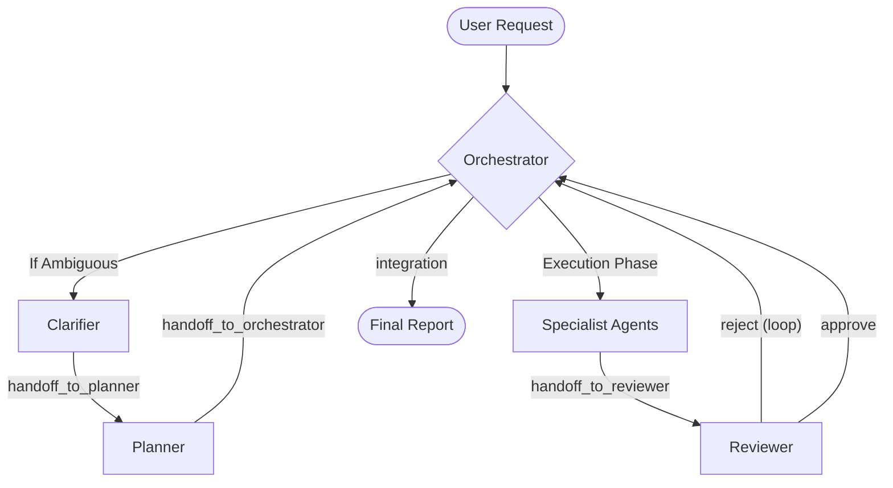

# System Analysis: Agent Orchestra

This document provides a comprehensive analysis of the Orchestrator lifecycle, communication patterns, and handoff integrity as of February 2026.

## 1. Orchestrator Lifecycle Diagram

The following diagram illustrates the standard flow from user request to final report.

**Lifecycle Phases:**

1. **Clarification:** Resolves blocking ambiguity.
2. **Planning:** Strategic decomposition into packetized tasks.
3. **Execution:** Specialist agents (Junior/Senior/Domain) implement changes.
4. **Review:** Quality and scope validation (Strict Release Gate).
5. **Completion:** Reporting and workspace hygiene (Changelog/Backlog).

## 2. Communication Patterns Matrix

| Agent | Input Format | Output Format | Primary next_action | Trigger Type |
| :--- | :--- | :--- | :--- | :--- |
| **Clarifier** | User Query | YAML Packet | `handoff_to_planner` | Blocking |
| **Planner** | Requirements | YAML Plan | `handoff_to_orchestrator` | Blocking |
| **Executor** | Packet | YAML Status | `handoff_to_reviewer` | Blocking |
| **Reviewer** | Diff/Report | YAML Review | `return_to_orchestrator` | Blocking |
| **Orchestrator** | Lifecycle Hooks | - | - | Coordinator |

*Note: All `runSubagent` calls are logically sequential/blocking within the current platform reality.*

## 3. Handoff Verification Table

| Source Agent | `next_action` Token | Target Role | Exists? | Contract Honored? |
| :--- | :--- | :--- | :--- | :--- |
| Clarifier | `handoff_to_planner` | Planner | Yes | Yes |
| Planner | `handoff_to_orchestrator` | Orchestrator | Yes | Yes |
| Junior Dev | `handoff_to_reviewer` | Reviewer | Yes | Yes |
| Backend Dev | `handoff_to_reviewer` | Reviewer | Yes | Yes |
| Reviewer | `return_to_orchestrator` | Orchestrator | Yes | Inconsistent (uses `return_` vs `handoff_`) |
| Designer | `handoff_to_frontend` | Frontend Dev | Yes | Potential Bypass (bypasses Orchestrator flow) |
| Documentation | (None) | (None) | **No** | **No** (Missing Output Contract) |

## 4. Current State Assessment

### Workflow Match

The implementation largely matches the documentation, but has non-deterministic handoff naming conventions and missing contracts in newer/utility roles.

### Workflow Gaps

- **Parallelism Gap:** While the Orchestrator identifies parallel-safe tasks, the platform executes them sequentially via blocking tool calls.
- **Reviewer Loop:** The `return_to_orchestrator` token is unique to the Reviewer, whereas all other agents use `handoff_to_*`.
- **Documentation Void:** The Documentation Agent performs file edits without providing a machine-readable output contract, making it difficult for the Orchestrator to track its success programmatically.

### Critical Issues

1. **Documentation Agent Non-Conformity:** Missing `Output Contract` section in [prompts/documentation-agent.md](../prompts/documentation-agent.md).
2. **Kickoff Metadata:** [prompts/native-orchestrator-kickoff.md](../prompts/native-orchestrator-kickoff.md) lacks standard YAML frontmatter, preventing automated tool indexing.
3. **Handoff Naming Inconsistency:** Mix of `handoff_to_orchestrator`, `return_to_orchestrator`, and agent-specific tokens like `handoff_to_frontend`.
4. **Platform Reality:** `runSubagent` is a blocking call. Parallelism is currently a conceptual optimization that is not reflected in actual execution timing.

## 5. Summary of Lifecycle Assessment

The system has a clear, robust architecture but suffers from "protocol drift" as new specialist agents are added. The Reviewer role is correctly positioned as a mandatory gate, but the communication tokens need standardization to ensure the Orchestrator can handle all agent outputs with a single parser.

**Top 3 Handoff/Contract Issues:**

1. **Missing Contract:** Documentation Agent lacks any YAML output block.
2. **Token Divergence:** `Reviewer` uses `return_to_orchestrator` while `Executor` uses `handoff_to_orchestrator`.
3. **Encapsulation Leak:** `Designer` suggests `handoff_to_frontend`, which assumes local knowledge of the next target rather than yielding to the Orchestrator.
