# Tool Capability Matrix

**Generated:** February 17, 2026  
**Source Analysis:** Prompt frontmatter + bodies across all 18 agent files  
**Related:** [PROMPT_AUDIT.md](./PROMPT_AUDIT.md)

---

## Summary

This document maps declared tools to actual capabilities and identifies autonomy blockers across all orchestra agents. Key findings:

- **2 Tool Schema Conventions** in use (specific names vs. `vscode` aggregate)
- **3 Agents** lack file-editing capability by design (Orchestrator, Clarifier, Reviewer)
- **1 Agent** lacks sub-delegation (Documentation Agent - autonomy blocker)
- **5 Critical inconsistencies** blocking autonomous operation

---

## 1. Complete Tool Capability Matrix

| Agent | Declared Tools | Can Do | Cannot Do | Autonomy Blockers |
|-------|----------------|---------|-----------|-------------------|
| **Orchestrator** | `read/readFile`, `agent`, `vscode/memory`, `memory` | Read files, delegate to specialists, store learnings | Edit files, execute commands, git operations | ✅ None (by design - coordinator only) |
| **Planner** | `vscode`, `execute`, `read`, `agent`, `search`, `web`, `todo`, `vscode/memory`, `memory`, `vscode/askQuestions` | Research codebase, search docs/web, ask blocking questions, create plans | Write code (contradicts having `execute` tool) | ⚠️ Has `execute` but prompt forbids code - **tool/role mismatch** |
| **Clarifier** | `vscode`, `read`, `search`, `agent`, `vscode/memory`, `memory`, `vscode/askQuestions` | Read files, search, ask questions, clarify requirements, sub-delegate | Write code, execute commands | ✅ None (by design - requirements only) |
| **Documentation Agent** | `read/readFile`, `edit`, `terminal`, `git` | Read/write docs, run git/commit, execute shell commands | **Sub-delegate to other agents** | 🚨 **CRITICAL:** Cannot delegate - must implement everything itself |
| **Junior Developer** | `vscode`, `execute`, `read`, `edit`, `search`, `web`, `agent`, `todo`, `vscode/memory`, `memory` | Full implementation (read/write/execute/search/delegate) | Nothing (technically) | ⚠️ **No technical guardrails** - same tools as Senior Fullstack |
| **Mobile Developer** | `read`, `execute`, `edit`, `search`, `web`, `agent`, `todo`, `memory` | iOS native (Swift/SwiftUI) | Nothing | ✅ None (can escalate to Sr Fullstack) |
| **Frontend Developer** | `vscode`, `execute`, `read`, `edit`, `search`, `web`, `agent`, `todo`, `vscode/memory`, `memory` | Full implementation capabilities | Nothing | ✅ None (can escalate via `agent`) |
| **Backend Developer** | `vscode`, `execute`, `read`, `edit`, `search`, `web`, `agent`, `todo`, `vscode/memory`, `memory` | Full implementation capabilities | Nothing | ✅ None (can escalate via `agent`) |
| **Fullstack Developer** | `vscode`, `execute`, `read`, `edit`, `search`, `web`, `agent`, `todo`, `vscode/memory`, `memory` | Full implementation capabilities | Nothing | ✅ None (can escalate via `agent`) |
| **Sr Frontend Developer** | `vscode`, `execute`, `read`, `edit`, `search`, `web`, `agent`, `todo`, `vscode/memory`, `memory` | Full implementation capabilities | Nothing | ✅ None |
| **Sr Backend Developer** | `vscode`, `execute`, `read`, `edit`, `search`, `web`, `agent`, `todo`, `vscode/memory`, `memory` | Full implementation capabilities | Nothing | ✅ None |
| **Sr Fullstack Developer** | `vscode`, `execute`, `read`, `edit`, `search`, `web`, `agent`, `todo`, `vscode/memory`, `memory` | Full implementation capabilities | Nothing | ✅ None |
| **Data Engineer** | `vscode`, `execute`, `read`, `edit`, `search`, `web`, `agent`, `todo`, `vscode/memory`, `memory` | Full implementation capabilities (SQL/ETL focus) | Nothing | ✅ None (can escalate via `agent`) |
| **Designer** | `vscode`, `read`, `search`, `web`, `agent`, `todo`, `vscode/memory`, `memory` | Read, research, create design specs, sub-delegate | Edit files, execute commands | ✅ None (delegates to Frontend via `agent`) |
| **Prompt Writer** | `vscode`, `read`, `search`, `web`, `agent`, `todo`, `vscode/memory`, `memory` | Read, research, analyze prompts | **Cannot write prompt files directly** | ⚠️ Has `agent` but no `edit` - must delegate to create artifacts |
| **DevOps** | `vscode`, `execute`, `read`, `edit`, `search`, `web`, `agent`, `todo`, `vscode/memory`, `memory` | Full implementation capabilities (infra focus) | Nothing | ✅ None |
| **Executor** | `vscode`, `execute`, `read`, `edit`, `search`, `web`, `agent`, `todo`, `vscode/memory`, `memory` | Full implementation capabilities (fallback) | Nothing | ✅ None |
| **Reviewer** | `vscode`, `read`, `search`, `agent`, `todo`, `vscode/memory`, `memory` | Read/analyze code, search, sub-delegate back to devs | Edit files, execute commands | ✅ None (by design - review only) |
| **Native Kickoff** | *(No frontmatter)* | Unknown | Unknown | 🚨 **CRITICAL:** Ghost agent - no documented tools or purpose |

---

## 2. Tool Naming Conventions by Agent

### Convention A: Specific Tool Names
**Used by:** Orchestrator, Documentation Agent  
**Pattern:**
```yaml
tools: ['read/readFile', 'edit', 'terminal', 'git', 'agent', 'vscode/memory', 'memory']
```
**Characteristics:**
- Granular tool names (`read/readFile` vs `read`)
- Explicit git operations (`git` separate from `terminal`)
- Uses both `vscode/memory` and `memory`

### Convention B: Aggregate vscode Schema
**Used by:** All other agents (18 agents)  
**Pattern:**
```yaml
tools: ['vscode', 'execute', 'read', 'edit', 'search', 'web', 'agent', 'todo', 'vscode/memory', 'memory']
```
**Characteristics:**
- Uses `vscode` aggregate (unclear what this encompasses)
- Generic `read` (not `read/readFile`)
- Generic `execute` (not `terminal`)
- Some include `vscode/askQuestions` (Planner, Clarifier only)

### Impact
- **Tool discovery ambiguity:** Does `vscode` include git? Terminal? File system operations?
- **Regression risk:** Changing one convention affects 2 agents, the other affects 16
- **Onboarding friction:** New agents must choose a convention with no clear guidance

---

## 3. Tool-to-Capability Mapping

### Read-Only Agents (3)
| Agent | Primary Role | Declared Read Tools | Edit Capability |
|-------|--------------|---------------------|-----------------|
| Orchestrator | Coordination | `read/readFile` | ❌ None |
| Clarifier | Requirements | `read` (via `vscode`) | ❌ None |
| Reviewer | Validation | `read` (via `vscode`) | ❌ None |

**Autonomy Impact:** ✅ Appropriate constraints - these agents delegate implementation work

### Research + Design Agents (2)
| Agent | Primary Role | Can Write? | Must Delegate? |
|-------|--------------|-----------|----------------|
| Designer | UX/Design specs | ❌ No `edit` | ✅ Yes (to Frontend) |
| Prompt Writer | Prompt engineering | ❌ No `edit` | ✅ Yes (to Junior/Executor?) |

**Autonomy Impact:** ⚠️ Prompt Writer may need direct `edit` access to iterate on prompt files

### Full-Capability Implementation Agents (11)
All developer roles (Junior, Frontend, Backend, Fullstack + Senior variants, Data Engineer, DevOps, Executor) have identical tooling:
- `vscode`, `execute`, `read`, `edit`, `search`, `web`, `agent`, `todo`, `vscode/memory`, `memory`

**Autonomy Impact:** ⚠️ No technical differentiation between Junior and Senior roles

### Standalone Specialized Agent (1)
| Agent | Tools | Can Delegate? | Autonomy Blocker |
|-------|-------|---------------|------------------|
| Documentation Agent | `read/readFile`, `edit`, `terminal`, `git` | ❌ **No `agent` tool** | 🚨 **Cannot escalate or get help** |

**Autonomy Impact:** 🚨 **HIGH SEVERITY** - Must implement all work solo, cannot delegate complex tasks

---

## 4. Autonomy Blocker Analysis

### 🚨 Critical Blockers (Require immediate fix)

#### 1. Documentation Agent Missing Sub-Delegation
- **Impact:** Cannot get help with complex tasks (e.g., analyzing architecture, generating diagrams)
- **Symptom:** Must implement everything itself or fail
- **Fix:** Add `agent` tool to frontmatter, update prompt body with delegation guidance
- **Affects:** All documentation workflows

### ~~Native Orchestrator Kickoff Ghost Agent~~ ✅ RESOLVED

**Status:** RESOLVED - File deleted in Phase 3 (v0.4.0)  
**Resolution Date:** 2026-02-17  
**Original Issue:** Undocumented prompt file with no frontmatter or purpose  
**Action Taken:** File deleted, all references purged from documentation

#### 3. Tool Schema Fragmentation
- **Impact:** 2 incompatible tool naming conventions in production
- **Symptom:** Orchestrator uses `read/readFile`, developers use `read` - which wins?
- **Fix:** Standardize all prompts on one convention (recommend Convention B for majority)
- **Affects:** Tool discovery, prompt portability, debugging

### ⚠️ High-Priority Issues (Impact deployment reliability)

#### 4. Planner Tool/Role Mismatch
- **Issue:** Has `execute` tool but prompt forbids writing code
- **Impact:** Confusing capability surface - why have a tool you cannot use?
- **Fix:** Remove `execute` from Planner tools, or document its intended use case
- **Affects:** Planner autonomy, tool contract clarity

#### 5. Junior Developer Over-Privileged
- **Issue:** Identical toolset to Senior Fullstack (no technical guardrails)
- **Impact:** Cannot enforce complexity routing via tooling
- **Fix:** Consider tool restrictions OR explicit escalation triggers in prompt body
- **Affects:** Work routing, quality control

#### 6. Prompt Writer Cannot Write Files
- **Issue:** Has `agent` but no `edit` - must delegate to create prompt files
- **Impact:** Extra coordination overhead for simple file writes
- **Fix:** Add `edit` tool OR document delegation pattern to Junior Developer
- **Affects:** Prompt iteration speed

### 📋 Medium-Priority Issues (Technical debt)

#### 7. Handoff Token Inconsistencies
- **Issue:** Some agents use `handoff_to_frontend`, others use `handoff_to_orchestrator`
- **Impact:** Orchestrator may misparse completion signals
- **Fix:** Standardize on `next_action: handoff_to_orchestrator` for all completion paths
- **Affects:** Coordination reliability (documented in PROMPT_AUDIT.md)

#### 8. Memory Tool Stability
- **Issue:** Prompts note `vscode/memory` is "experimental in some builds"
- **Impact:** Non-deterministic tool availability across environments
- **Fix:** Document fallback behavior when memory unavailable
- **Affects:** Learning persistence, context retention

#### 9. No Testing/Validation Tool
- **Issue:** Agents have `execute` but no explicit test framework awareness
- **Impact:** Validation steps are ad-hoc, inconsistent across agents
- **Fix:** Document standard validation commands in AGENTS.md template
- **Affects:** Quality assurance, regression prevention

#### 10. No Rollback/Recovery Tools
- **Issue:** No documented git rollback or error recovery procedures
- **Impact:** Agents cannot autonomously recover from failed changes
- **Fix:** Add operational runbook for common failure modes
- **Affects:** Reliability, autonomous operation under failure

---

## 5. Dependency Graph

```mermaid
graph TB
    User[👤 User] -->|delegates| Orchestrator
    
    Orchestrator -->|clarify| Clarifier
    Orchestrator -->|plan| Planner
    Orchestrator -->|implement| Developers
    Orchestrator -->|design| Designer
    Orchestrator -->|docs| DocAgent[Documentation Agent]
    Orchestrator -->|prompts| PromptWriter[Prompt Writer]
    Orchestrator -->|review| Reviewer
    
    Clarifier -.->|can delegate| Orchestrator
    Planner -.->|can delegate| Orchestrator
    Designer -.->|can delegate| Frontend[Frontend Dev]
    PromptWriter -.->|unclear delegation| Unknown[?]
    
    Reviewer -->|reject fixes| Developers
    
    Developers -->|escalate| SeniorDevs[Senior Developers]
    
    DocAgent -.->|BLOCKED: cannot delegate| X[❌]
    
    style DocAgent fill:#ff6b6b
    style X fill:#ff6b6b
    style PromptWriter fill:#ffd93d
```



**Legend:**
- Solid lines: Orchestrator-controlled delegation (`runSubagent`)
- Dashed lines: Agent-initiated sub-delegation (`agent` tool)
- Red: Critical blocker
- Yellow: Warning/ambiguity

---

## 6. Concurrency + Parallelization Capabilities

### Orchestrator Parallelization Logic
From [orchestrator.md](../prompts/orchestrator.md), the Orchestrator can run packets in parallel if:
1. Packets are marked `mode: parallel` in the plan
2. Touched file sets are **disjoint** (no overlapping edits)

### Agent Concurrency Readiness

| Agent | Can Be Called in Parallel? | Blocks Parallel Execution? | Notes |
|-------|----------------------------|----------------------------|-------|
| Orchestrator | ❌ No (coordinator) | N/A | Single point of coordination |
| All Developers | ✅ Yes | Only if touching same files | Orchestrator validates disjoint file sets |
| Reviewer | ✅ Yes | ❌ No | Read-only, can review multiple packets simultaneously |
| Designer | ✅ Yes | ❌ No | Read-only, produces specs for multiple features |
| Documentation Agent | ⚠️ Limited | ⚠️ **Cannot be parallelized** if docs touch shared files (README, CHANGELOG) | Missing `agent` tool prevents internal work delegation |
| Prompt Writer | ✅ Yes | ❌ No | Read-only analysis phase (but delivery unclear) |

**Key Limitation:** Documentation Agent frequently touches shared files (README.md, CHANGELOG.md, BACKLOG.md), which blocks concurrent feature work if docs must be updated simultaneously.

---

## 7. Tool Availability by Environment

### Universal Tools (All Agents)
- `read` / `read/readFile` - File reading (naming varies)
- `search` - Codebase search (via `vscode` or explicit)

### Execution Tools (11 Implementation Agents)
- `execute` / `terminal` - Shell command execution
- `edit` - File modification

### Coordination Tools (All Agents Except Documentation)
- `agent` / `runSubagent` - Sub-delegation

### Experimental/Optional Tools
- `vscode/memory`, `memory` - Contextual learning (availability varies by VS Code build)
- `vscode/askQuestions` - User clarification (Planner, Clarifier only)
- `web` - External web search (All developers, Designer, Prompt Writer, Planner)

---

## 8. Recommendations

### Immediate Actions (Week 1)
1. **Add `agent` tool to Documentation Agent** - Critical for autonomy
2. **Standardize tool naming** - Migrate Orchestrator + Documentation Agent to Convention B (majority pattern)
3. **Document/remove Native Kickoff agent** - Clear roster ambiguity

### Short-Term (Month 1)
4. **Remove `execute` from Planner** OR document its use case - Resolve tool/role conflict
5. **Add `edit` to Prompt Writer** OR document standard delegation pattern
6. **Standardize handoff tokens** - All agents → `handoff_to_orchestrator`

### Medium-Term (Quarter 1)
7. **Define Junior vs. Senior tool restrictions** - Technical guardrails or explicit escalation triggers
8. **Create validation runbook** - Standard test commands per project type
9. **Document memory fallback** - Behavior when `vscode/memory` unavailable
10. **Create rollback runbook** - Git recovery procedures for common failures

---

## Appendix: Tool Comparison Table

| Tool Name | Convention A (2 agents) | Convention B (18 agents) | Semantic Difference? |
|-----------|-------------------------|--------------------------|----------------------|
| File Read | `read/readFile` | `read` | ❓ Unclear - assumed equivalent |
| File Edit | `edit` | `edit` | ✅ Consistent |
| Shell Exec | `terminal` | `execute` | ❓ Unclear - assumed equivalent |
| Git Ops | `git` (explicit) | *(implied in `vscode` or `execute`?)* | ⚠️ **Ambiguous** |
| Sub-Delegate | `agent` | `agent` | ✅ Consistent |
| Memory | `vscode/memory`, `memory` | `vscode/memory`, `memory` | ✅ Consistent |
| Search | *(implied in `read/readFile`?)* | `search` (explicit) | ⚠️ **Ambiguous** |
| Web Search | Not listed | `web` | ⚠️ **Missing in Convention A** |
| Aggregate | None | `vscode` | ❓ **Unknown scope** |

**Critical Unknowns:**
- What does `vscode` include? (edit + read + search + git?)
- Are `read/readFile` and `read` functionally equivalent?
- Can Convention A agents search the web? (No `web` or `search` listed)
